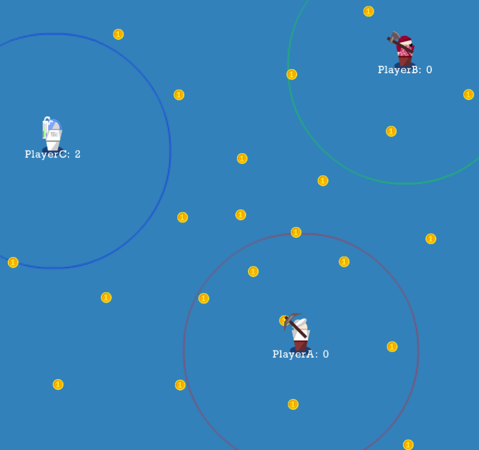

# CoinsGatherAI
Playground for designing AI agents in a coins gathering game

# How to start
Open the the project in a code editor (like VS Code) and run it via a live server 

You will see a field of coins, 3 units of Airapport games and circles around them

# How is the simulation organized

Each unit has own field ov view (depicted by a circle). Every 500ms the game world builds an ocject containing an array of relative coordinates of visible coins and an array of relaive coordinates of visible units. This object is received by an AI module and this module defines the relative coordinates of the desirede movement

File ai.js contains 3 very basic realizations of AI. 
BasicAI - does not move at all
RandomMoverAI - moves in a random direction
CoinsChaserAI - is it sees coins, tries to grab the first coin in the list (not necessarily the closes one), otherwise - moves in a random direction

File config.js contains a class GameConfig, and its array botsInTournament contains information about the players in the tournament which we organize.
Their colors, images, names and used AIs

As you see, PlayerA does not move at all as it is controlled by BasicAI.

Change its AI to CoinsChaserAI or RandomMoverAI and see how its behaviour changes.

You can add new lines to the botsInTournament array (just make sure to use different frames and names to differentiate agents). You can assign the same AI to multiple players.

# Designing your own AI

As you see, CoinsChaserAI most of the time goes to the top-right direction. This is because the game world populates the list of the visible items starting from the top-right corner.

Create a new AI class in ai.js, name it RandomCoinsChaserAI. You can copy-paste the CoinsChaserAI code. We will now make it chase the radomly selected coin instead of the first one in the list. For this change the lines:
			dx = situationOb.items[0].dx
			dy = situationOb.items[0].dy
with the lines
			let id = Math.floor(Math.random()*situationOb.items.length)
			dx = situationOb.items[id].dx
			dy = situationOb.items[id].dy